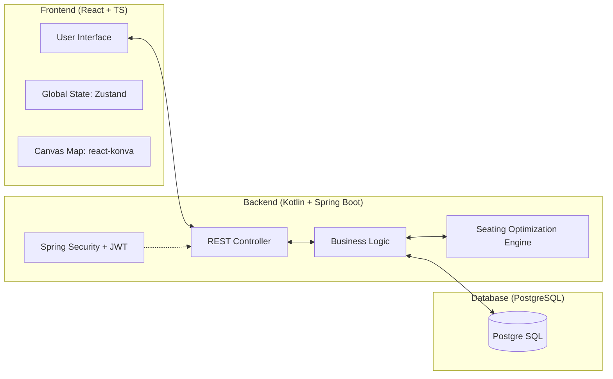
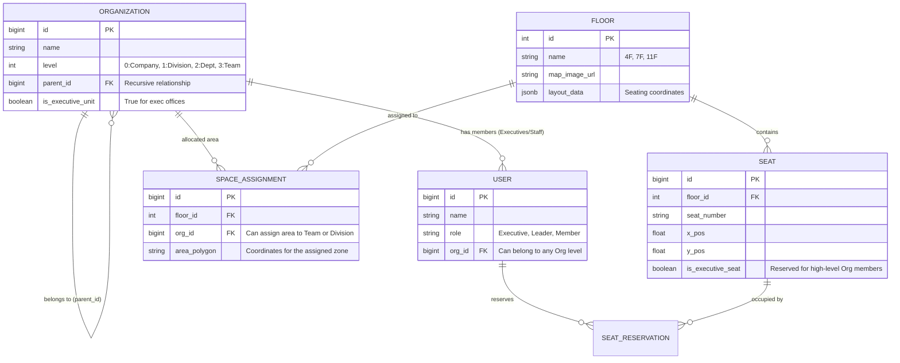

# [SDD] SpaceManager 시스템 상세 설계서 (System Design Document)

본 문서는 사내 좌석 배치 최적화 시스템인 **SpaceManager**의 기술적 아키텍처와 상세 구현 스펙을 정의합니다.

---

## 1. 전체 시스템 아키텍처 (CTO Working Group View)



---

## 2. 데이터베이스 모델링 (ERD & 테이블 명세)

### 2.1 ERD (Mermaid)


---

## 3. 핵심 API 인터페이스 명세서

### 3.1 조직도 관리
*   **API**: `GET /api/v1/organizations/tree`
*   **Response**: `Object` (Recursive Organization Tree)

### 3.2 자동 배치 시뮬레이션
*   **API**: `POST /api/v1/simulation/recommend`
*   **Request Body**:
    ```json
    {
      "weights": { "proximity": 0.7, "stability": 0.3 },
      "floor_ids": [4, 7, 11]
    }
    ```
*   **Response**: `List<TeamAssignment>` (Proposed assignments per floor)

---

## 4. 폴더 구조 및 컴포넌트 분리 전략 (FE/BE 리더)

### 4.1 Frontend Component Strategy
*   **Atomic Design Pattern** 기반 컴포넌트 분리
*   **Canvas Layer 분리**: BackgroundMap(이미지), GridLayer(구역), InteractionLayer(좌석 선택)
*   **State Management**: `Zustand` 를 통한 가벼운 전역 상태 관리 및 서버 데이터 싱크 (`React Query`)

### 4.2 Backend Folder Structure (ddd-like)
```
com.spacemanager.api
├── common (security, exception, util)
├── domain
│   ├── organization (entity, repository, service)
│   ├── seating (optimization engine, model)
│   └── user (auth, profile)
└── web (controller, dto)
```

---

## 5. 보안 및 예외 처리 방안 (보안 전문가/QA)

*   **오버플로우 전략 (Overflow Strategy)**:
    - 층별 가용 좌석 초과 시, **'조직 응집도 점수'**를 계산하여 가장 낮은 팀부터 인접 층으로 이동시키는 최적화 알고리즘 적용
*   **근접도 가중치 (Proximity Parameters)**:
    - 임원석과의 거리는 고정된 수치가 아닌, 관리자가 설정한 **'임계 파라미터'**와 **'가중치'**에 따라 동적으로 계산되도록 엔진 설계
    - **Defense in Depth**: API 요청마다 JWT 토큰 검증 및 RBAC(Role-Based Access Control) 적용
    - **SQL Injection 방지**: JPA(Spring Data) 활용으로 파라미터 바인딩 강제
*   **Exception Handling Policy**:
    - **전역 예외 핸들러**: `@RestControllerAdvice`를 통한 에러 응답 규격화 (ErrorCode 및 ErrorMessage 반환)
    - **좌석 선점 충돌**: DB 비관적 락(Pessimistic Lock)을 적용하여 동시 좌석 선택 시 정합성 보장

---

## 🚀 3줄 요약 및 비유
1. **아키텍처**: "지능형 내비게이션"처럼, 수많은 팀(차량)이 목적지(임원석)에 가장 빠르고 효율적으로 도착할 수 있는 길(좌석)을 찾아주는 구조입니다.
2. **데이터 설계**: 우리 회사의 조직 구조를 "퍼즐 조각"으로, 상면을 "퍼즐 판"으로 설계하여 어떤 조각이라도 완벽하게 맞춰질 수 있게 했습니다.
3. **보안/안정성**: "은행 금고" 수준의 출입 통제(인증)와 "이중 장금 장치"(예외 처리)를 통해 데이터의 유출과 충돌을 완벽히 방지합니다.

**비유**: 이 시스템은 거대한 레고 박스와 같습니다. 관리자가 레고 블록(조직 데이터)과 설명서(배치 규칙)를 넣으면, 시스템이 가장 멋진 성(사무실 배치)을 제안하고, 팀원들은 본인이 머물 방을 고르기만 하면 됩니다.
