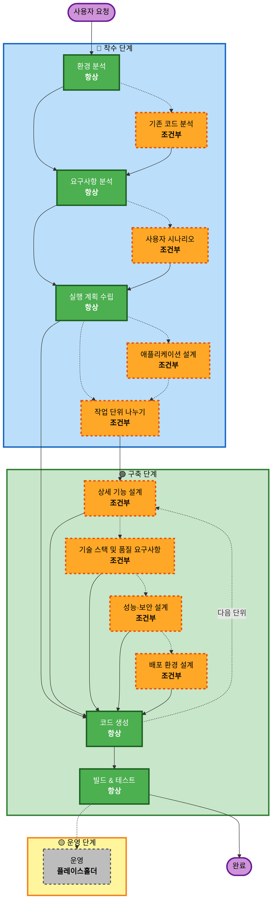

# AI-DLC 워크플로우 다이어그램

> 단계 설명 및 실행 로직 → `rules/workflow-ko.md` 참조

## 3단계 개요

- **착수 (INCEPTION)**: 계획 및 아키텍처 — 무엇을, 왜 만들지 결정
- **구축 (CONSTRUCTION)**: 설계, 구현, 빌드 및 테스트 — 어떻게 만들지 결정
- **운영 (OPERATIONS)**: 향후 배포 및 모니터링 워크플로우를 위한 플레이스홀더

## 워크플로우 다이어그램

**범례**: 실선 테두리 = 항상 실행 · 점선 테두리 = 조건부 실행
